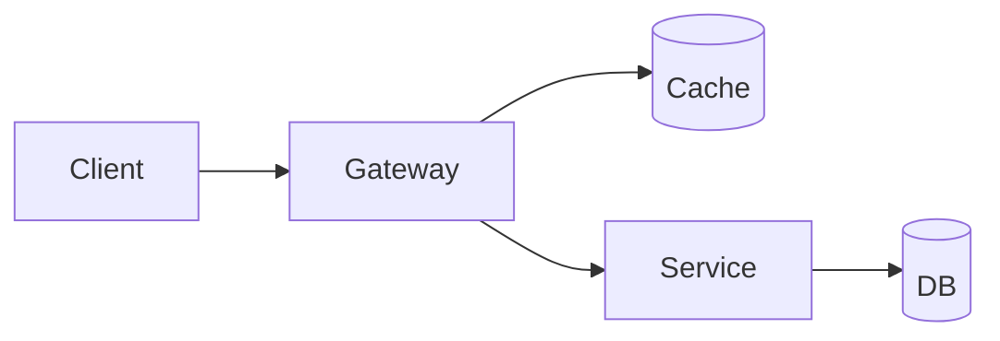

---
# Your Project Title
subtitle: A clean, interactive Slidev baseline
author: Your Name
date: {{ new Date().toLocaleDateString() }}
layout: cover
class: text-left

---

<!-- Slide 2: Table of contents (auto) -->
---
layout: none
hide: false
---

<!-- Slide 3: Mermaid with step-through highlight -->
---
class: relative
---

# System flow (high-level)

